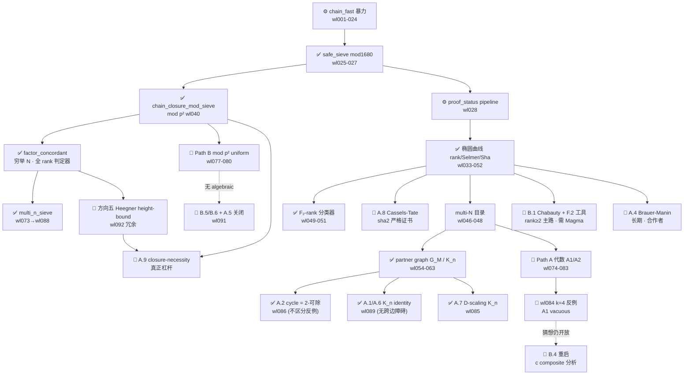

# 探索脉络图 (Exploration Map)

> **这份文档回答一件事**：d19 从 wl001 到 wl092 到底探索过哪些方向、它们如何
> 彼此衍生、各自现在是什么状态、为什么有些撞了墙。它是「所有 worklog 的下一步
> 计划」的总集成视图，配合 [`OPEN_DIRECTIONS.md`](./OPEN_DIRECTIONS.md)（逐条
> 可执行清单）与 [`THEORY_DIRECTIONS_ADVANCED.md`](./THEORY_DIRECTIONS_ADVANCED.md)
> （高级理论方向）一起读。
>
> 维护规则：新 worklog 落地后，在对应「脉络」补一行；方向关闭时把节点标 🛑 并写
> 一句墙的原因。**最后更新：2026-05-31（wl092 后）**。

## 图例

| 标记 | 含义 |
|---|---|
| ✅ | 已完成（含 informative negative：做完了，结论是「此路不通/不构成障碍」） |
| 🛑 | 已被否定 / 关闭（撞墙，附原因） |
| 🟡 | 部分实现 / 进行中 / 暂缓 |
| 🔵 | 开放、未启动、值得做 |
| ⚙️ | 工程基础设施（不直接推进证明，但支撑实证） |

---

## 一、五个阶段（时间线）

```
阶段 0  wl001–027 (archive)   chain-fast 暴力搜索纪元：参数化搜索 → numpy/GPU 向量化
                              → D4 去重 → parity/side 过滤 → mod 1680 safe sieve
                              → concordant 椭圆曲线归约成型
阶段 1  wl028–052             proof_status 判定流水线 + 椭圆曲线 rank/Selmer/Sha 工具
                              → factor_search 穷举 N → F₂-rank 分类器 → multi-N 目录
阶段 2  wl053–066             partner graph G_M / K_n hub / cycle / Δ-near-miss
                              → 全 G_M closure 扫描 338,225 顶点 × 0 反例
阶段 3  wl067–072             性能工程：AB sieve 排序、fast-core、PARI 单线程修复
阶段 4  wl073–084             严格证明双线：Path A（代数 A1/A2）+ Path B（mod p² 联立筛）
                              → 两条都在 wl080/wl084 撞墙（path B 无 algebraic；A1 vacuous）
阶段 5  wl085–092             方向清算批次：逐条评估 OPEN_DIRECTIONS，把能落地的落地、
                              能关闭的关闭（A.1/A.2/A.6/A.7/D.1/C.2-4/F.1/F.2/F.4 done；
                              A.5/方向五 height-bound 关闭）
```

---

## 二、七条脉络（按主题）

### 脉络 ① 工程穷举搜索 ⚙️（主干，一直在用）

> 目标：在尽可能大的 max_hyp 上**严格证否**（没有 Harborth 反例）。

```
chain_fast 暴力 (wl001-024)
  └─ safe_sieve  mod 1680 2-adic 必要条件 (wl025-027)        ✅ 主筛
       └─ chain_closure_mod_sieve  mod p² 联立筛 (wl040)      ✅ 砍 99.6% hard_case
            └─ factor_concordant  穷举全部 concordant N (wl035, factor_search.py) ✅ 全 rank 判定器
                 └─ multi_n_sieve  k<2 ⇒ no_solution (wl073 → 入主线 wl088)  ✅
                 └─ dual_closure_sieve  对偶筛 (wl073)         ✅ 6/16 dual-only pair 不可省
       └─ proof_status 判定流水线 (wl028)                     ✅ DEFAULT_METHOD_PIPELINE
            └─ fast-core 两阶段模式 (wl069) + AB sieve 排序 (wl067-068) ⚙️
            └─ 公共并行层 parallel_map (wl045, wl064)          ⚙️
            └─ PARI 单线程修复（survivor 审计挂起）(wl070-071) ⚙️
```

**当前实证上限**：max_hyp ≤ 2M（226k safe-pass multi-N pair 全杀，wl080）；
max_hyp=500 时 6172 pair → 5852 严格 no_solution + 320 hard_case（5.18%）。

**开放/暂缓**：
- 🟡 C.5/C.6 推 max_hyp → 10⁷（需 Cython/向量化；**仅增信心不构成证明**，ROI 低）
- 🟡 C.1 chain_db 增量缓存、C.7 GPU int64 保护、C.8 ParallelExecutor 替换（纯工程）

---

### 脉络 ② 椭圆曲线 rank / Selmer / Sha ✅（rank 过滤器完全失效已定论）

> 目标：用 $E_{A,B}: Y^2=X(X+A^2)(X+B^2)$ 的算术不变量把 hard_case 判死。

```
concordant 归约 + compute_rank (wl020, wl036)
  └─ PARI ellrank / Selmer API (wl033, wl035)               ✅
       └─ ell2cover sha2 显式 quartic (wl039, wl042)          ✅ 13/156 sha2≥2 case
       └─ F₂-rank 分类器 (wl049) → 接入 pipeline (wl051, C.3)  ✅ rank 下界，免 PARI
       └─ D.1 110@50k + 190@100k F₂-rank≥3 pair ellrank (wl050/052/087) ✅ 全 certified
```

**关键定论**：
- **rank 过滤器实测过滤率 0%**——所有 chain-survivor 的 $E_{A,B}$ 都 rank≥1（rank 判
  无解完全失效）。
- **PARI rank 精确率 100%**（320/320 lower==upper）⟹ 方向六（L-函数判 rank）、方向九
  （second descent 压 Selmer）作为「判 rank」工具**冗余**。
- **2-descent 平凡**：所有 concordant 点 $Q_N \in 2E(\mathbb{Q})$（wl035 + wl086 重证），
  经典 Selmer obstruction 不直接适用。
- hard_case rank 分布（max_hyp=500，320 个）：rank1=36.9% / **rank2=48.4%（主流）** /
  rank3=13.4% / rank4=1.2%。

**开放**：
- 🔵 **A.8 Cassels-Tate pairing**：把 `sha2_lower>0` 升级为严格 Sha[2] 证书（wl036/044
  反复提、从未启动；156 case 的 Sha[E][2] dim 稳定=2）。只对 sha2≥2 子类有效。
- 🔵 D.2 (1845,2912) / D.3 (27328,44055) / D.4 (153,560) 个案 MW 结构审计
- 🔵 D.5 9 outlier explicit cover quartic 的 everywhere-local-solubility（与 A.8 重叠）
- 🔵 D.6 max_hyp=5000 → 750 sha2≥2 case 扩样本（验证 n_covers=rank+4 公式）

---

### 脉络 ③ Path A — 代数严格证明 🛑（撞墙：A1 vacuous，但猜想本身仍开放）

> 目标：纯代数证明「multi-N ⟹ rank 足够高 ⟹ closure fiber 无整数解」。

```
half-point + signature (half_points.py)
  └─ wl074  k=2 closure fiber 分析：1879/1879 实证 rank≥2
       └─ wl076  A1 sketch：k=2 ⟹ rank≥2，F₂-rank image α = rank+1
            └─ wl081  step(a) sign argument ✅ 严格；step(b) 收窄成 Conjecture A2
                 └─ wl082  A2-hard (d₂=d₃=1) Gaussian integer 证明
                      └─ wl083  "A1 完全证完" （sf(x_Q)=d₂d₃ 简化）
                           └─ 🛑 wl084  k=4 反例 (426496,482625,N=352800) 暴露 wl082 BUG
                                        （c=1073=29×37 composite ⟹ c² 两平方和表示不唯一）
```

**墙的原因（wl084 诚实重评）**：
- wl082 的 Gaussian 唯一分解论证**只对 c 是 prime-power 时成立**；c composite 时失效。
- wl081-083 链在 k=2 sample 上 **vacuously hold**（实证 hypothesis 从未触发）。
- ⚠️ **关键区分**：被否定的是「那条具体证明路径」；命题「k=2 ⟹ rank≥2」**实证
  1879/1879 universal、仍是开放猜想**，且是 path A 最有希望的代数突破点。

**衍生关闭**：B.2 A_k 推广 k≥3（k=4 实证就有反例 🛑）、B.3 wl082 修补（工作量大 🛑）。

**开放**：
- 🔵 **B.4 重启**：找「c² 的所有两平方和表示如何与 Pythagorean 参数关联」的更细分析
  （wl084 判工作量大、暂不做，但这是唯一能把 A1 变严格的路径）。

---

### 脉络 ④ Path B — mod p² uniform 联立筛 🛑（撞墙：无简单 algebraic）

> 目标：证明存在有限素数集 M₀，使所有 safe-pass (A,B) 的 closure 在某 mod p² 上无解。

```
chain_closure_mod_sieve mod p² (wl040)              ✅ 实证砍 99.6%
  └─ wl073  dual_closure_sieve + N-side 理论
       └─ wl077  height-bound 假设 min ĥ > 2log(A+B)  🛑 1879/1879 fail（→ B.6）
       └─ wl078  uniform mod p² audit (max_hyp=1M)
            └─ wl079  multi-N mod pattern：mod 9 干净 lemma B.9；v_p(D)≠1 假设 🛑 fail
                 └─ 🛑 wl080  path B 关闭：CRT 表明 mod-p² 永远剩 ≥0.017%，无 universal kill
```

**墙的原因**：mod p² (p≥5) 上无简单 closed-form 必要条件，也无 universal kill。
严格证明只能 case-by-case 或借新工具（Mazur uniform bound / descent）。

**衍生关闭**：B.5 path B 严格证明 🛑、B.6 height-bound 🛑、A.5 扩 safe_sieve 到
Peschmann 规模（wl091：与 mod p² 同坑，且会丢掉 p≡3 mod4 主力 killer）🛑。

---

### 脉络 ⑤ Partner graph G_M / K_n / cycle / multi-N ✅（结构清楚，0 反例）

> 目标：从「multi-N pair 的连接结构」找新的 closure 障碍。

```
multi-N 目录 (wl046, wl048 pivot-on-N)
  └─ wl054  partner pair graph 构建 + 完备性审计
       └─ wl055  K_n 等价定理 + k 分布 (K_3–K_8)
       └─ wl057  partner graph 理论对接文献 (PARTNER_GRAPH_THEORY.md)
            └─ wl058  BFS 发现 G_M 近似森林
                 └─ wl059  cycle 代数 vs MW rank deficit（circuit rank ≈ Σ(k−rank)）
                      └─ ✅ wl086 (A.2/E.3)  cycle 关系 = Q_N 的 2-可除性，**不区分反例**
                 └─ wl060  K_8/K_7/K_6 rank 审计：deficit 确认，rank ≤ 4 假设
                 └─ wl061  全 BFS：309,689 节点超级 component，99.6% tree
                 └─ wl062  degree = C(k,2)，发现 K_10，hubs disjoint
                      └─ ✅ wl085 (A.7)  D-scaling K_n 快速生成器：K_11/12/13 新发现
                      └─ ✅ wl089 (A.1/A.6)  K_n hub partner identity：49/49 全 2-可除，
                                              K_n ⟺ k≥n multi-N，上限 K_3，**无跨边障碍**
            └─ wl063  全 G_M closure 扫描：338,225 顶点 × **0 反例**
            └─ wl066  Δ-near-miss：min|Δ| 度量「离反例多远」
```

**关键定论**：partner / K_n / cycle 全是 multi-N 的不同切面；shared concordant 点恒
2-可除，**不提供区分反例的代数障碍**。高 k 主要来自放大倍数（wl065），**「高 k 更易
出反例」无据**。

**开放（低优先，多为数据/个案）**：
- 🔵 E.2 K_9/K_10 实例 ellrank、E.5 Δ-near-miss 与秩联动、E.7 partner-only 顶点 sha2/rank
- 🔵 PARTNER_GRAPH_THEORY §6.4 non-coprime anomaly：reduce 不保 multi-N，MW 的 scale 依赖
- 🔵 (15,48)↔(20,36) 类孤立 cycle 的代数解释（为何 catalog 不可达）
- 🟡 E.1 G_M BFS 推到 10M（**已暂缓**：1M 已 738s，且 K_11+ 已被 wl085 构造性回答）

---

### 脉络 ⑥ 高级理论方向 Heegner / Chabauty / Brauer–Manin 🟡🛑

> 目标：把「过滤器」升级成「判定器」，一次判死整类 hard_case。

```
方向五 Heegner + height (wl031 诊断, heegner_height.py)
  └─ 🛑 B.8 / wl092  height-bound 升级判为**冗余**：
       · factor_concordant 已穷尽全部 integer-N（全 rank，排在 heegner 前）
       · 残余 7 个 inconclusive hard_case 全 rank≥2，heegner（仅 rank=1）全 skipped
       · 需要的 height 上界又被 B.6/wl077 判不成立
       · 真正 gap 是 closure-necessity（脉络 ⑦），与 canonical height 无关
方向七 Chabauty / QC (B.1)
  └─ 🟡 F.2 / wl090  Stoll–Bruin 工具调研：Sage 有 Coleman 积分 / 经典 CC / two-cover
       descent，但 MW-sieve + 高亏格 rank 仍主要靠 Magma。B.1 从「全程要 Magma」降级为
       「两步要 Magma」。rank≥2 主流 hard_case（~48%）的主路。
方向八 Brauer–Manin (A.4)
  └─ 🔵 数月 + 合作者，最 powerful，未启动。
```

**开放**：
- 🔵 A.3 Heegner sieve on 9 outliers（⚠️ wl092：步骤3「height bound 枚举 N」不必做，
  直接用 factor_concordant 判即可）
- 🔵 B.1 Chabauty（配 F.2，需 Magma 两步）
- 🔵 A.4 Brauer–Manin（长期）

---

### 脉络 ⑦ 真正的开放杠杆 — closure-necessity 🔵（wl092 指认）

> 这不是某个 worklog 的副产品，而是 wl092 把脉络 ⑥ 证伪后**反推出的核心问题**，
> 且 MULTI_CONCORDANT_N_STRATEGY 早就独立提出过。

```
观察：inconclusive hard_case 卡住 ≠ integer-N 没枚举全（factor_search 已穷尽）
   ⟹ 是几何问题：Harborth 反例是否【必须】对应一个闭合 4-chain？
        └─ 🔵 A.9 closure-necessity 引理（纸面，先从 K_{2,2} ⟺ 4-chain 精确刻画入手）
        └─ 配套：closure 局部无解已有 mod p² 联立筛 99.6% 实证（脉络 ④）
        └─ 若证 closure 必要 + closure 局部无解 ⟹ 整类 pair 判死，且【不依赖 Magma】
```

**为何是最高杠杆**：它是少数能把 `inconclusive → no_solution` 且不需要外部重型工具
（Magma）的路径。风险是 closure 与反例的等价/包含关系本身可能就是开放命题。

---

### 脉络 ⑧ 文献 / 论文 / 形式化 🟡

```
wl032 文献综述 → Peschmann 2026 对标
  └─ wl047/057 文献笔记 (Ono / KSS / Halbeisen-Hungerbühler / Bremner-Ulas)
  └─ ✅ wl091 (F.4)  Peschmann §7(2) 深读：per-point 平方检测，非参数 sieve
  └─ ✅ wl090 (F.1)  conditional paper 骨架 CONDITIONAL_PAPER_OUTLINE.md（不依赖 A1 严格）
       └─ 🔵 F.1 正文：把骨架写成完整 conditional paper（现在就能变现，工作量=写作）
  └─ 🔵 F.3 Mazur uniform bound 文献（ROI 低）
  └─ 🔵 wl032 Tier3：联系 Bremner/Cremona/Ulas 学界（meta）
```

---

## 三、依赖 / 衍生关系图



---

## 四、已撞的墙（避免重走）

| 墙 | wl | 为什么不通 |
|---|---|---|
| 🛑 Path A 代数证明 A1 | wl084 | wl082 Gaussian 论证对 c composite 失效；k=2 上 vacuous |
| 🛑 A_k 推广 k≥3 | wl084 | k=4 实证就有反例 (426496,482625,N=352800) |
| 🛑 Path B mod p² uniform | wl080 | CRT 表明永远剩 ≥0.017%，无 universal kill |
| 🛑 height-bound 假设 | wl077 | min ĥ > 2log(A+B) 1879/1879 fail |
| 🛑 方向五 Heegner 判定器 | wl092 | factor_concordant 已穷尽 integer-N，冗余 |
| 🛑 扩 safe_sieve 到 Peschmann | wl091 | 同 mod p² 坑，且丢 p≡3 mod4 主力 killer |
| 🛑 hypotenuse identity blocker prime | wl034 | 基础假设（hᵢ 不含 ≡3 mod4 素因子）错 |
| 🛑 cycle / K_n 代数障碍 | wl086/089 | shared 点恒 2-可除，不区分反例 |
| 🛑 「高 k 更易出反例」直觉 | wl063/065 | 338,225 顶点 0 反例；高 k 来自放大倍数 |

---

## 五、当前开放前沿（按杠杆排序）

| # | 方向 | 脉络 | OPEN_DIRECTIONS | 杠杆 | 依赖 |
|---|---|---|---|---|---|
| 1 | closure-necessity 引理 | ⑦ | A.9 | ⭐⭐⭐ 能判死整类、不需 Magma | 纸面 |
| 2 | F.1 conditional paper 正文 | ⑧ | F.1 | ⭐⭐ 现在就能变现 | 写作 |
| 3 | B.1 Chabauty (rank≥2 主流~48%) | ⑥ | B.1 + F.2 | ⭐⭐ 覆盖最大 | Magma（两步） |
| 4 | A.8 Cassels-Tate (sha2≥2 子类) | ② | A.8 | ⭐⭐ 清最弱 case | PARI |
| 5 | A.3 Heegner on 9 outlier | ⑥ | A.3 | ⭐ 范围小（用 factor_concordant 即可） | PARI |
| 6 | B.4 重启 A1 (c composite) | ③ | B.4 | ⭐ 唯一让 A1 严格的路 | 纸面（难） |
| 7 | A.4 Brauer–Manin | ⑥ | A.4 | ⭐ 最 powerful | 数月+合作者 |

---

## 六、与其他文档的关系

- [`OPEN_DIRECTIONS.md`](./OPEN_DIRECTIONS.md) — 逐条**可执行**清单（A/B/C/D/E/F 分类 + 优先级汇总）。本图是它的「为什么/如何衍生」叙事版。
- [`THEORY_DIRECTIONS_ADVANCED.md`](./THEORY_DIRECTIONS_ADVANCED.md) — 方向五–十的**数学细节**（Heegner / Chabauty / Brauer–Manin / K3）。
- [`PROJECT_STATUS.md`](./PROJECT_STATUS.md) — 各路线**当前扮演的角色** + 实证数据快照。
- [`PARTNER_GRAPH_THEORY.md`](./PARTNER_GRAPH_THEORY.md) — 脉络 ⑤ 的理论主文档。
- [`MULTI_CONCORDANT_N_STRATEGY.md`](./MULTI_CONCORDANT_N_STRATEGY.md) — 脉络 ⑤/⑦ 的 multi-N 起源 + closure 任务。
- [`CONDITIONAL_PAPER_OUTLINE.md`](./paper/CONDITIONAL_PAPER_OUTLINE.md) — 脉络 ⑧ 的论文骨架。
